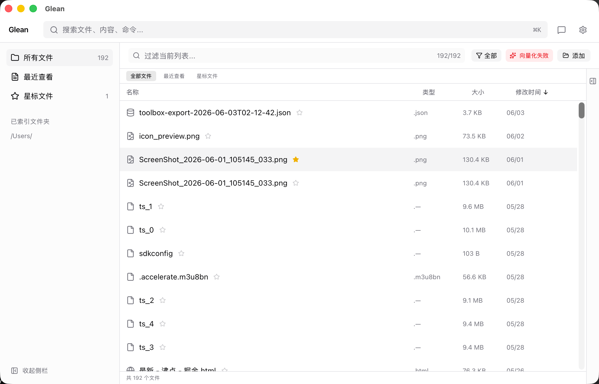
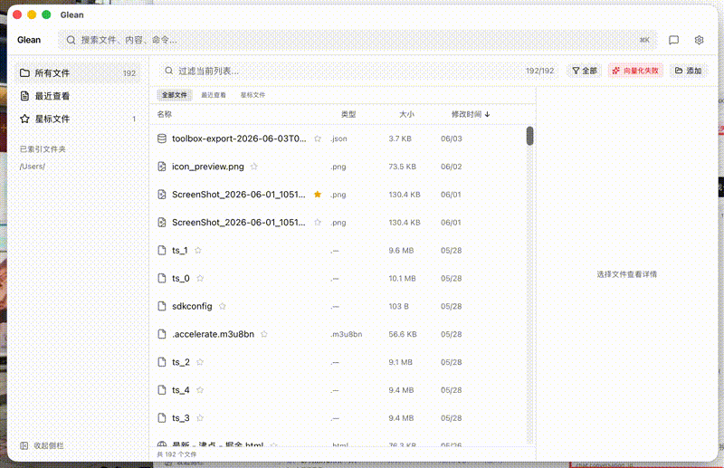
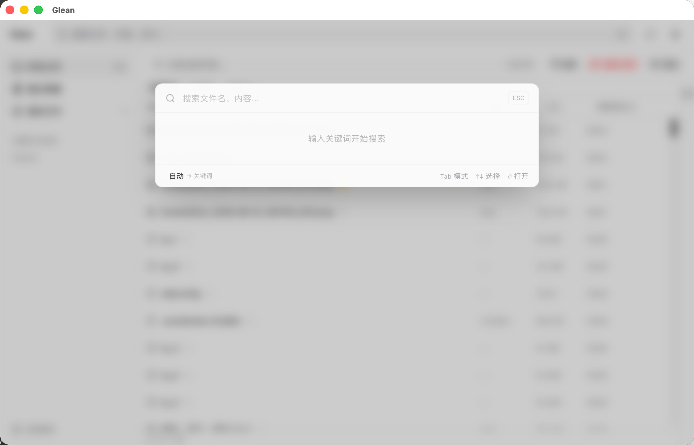
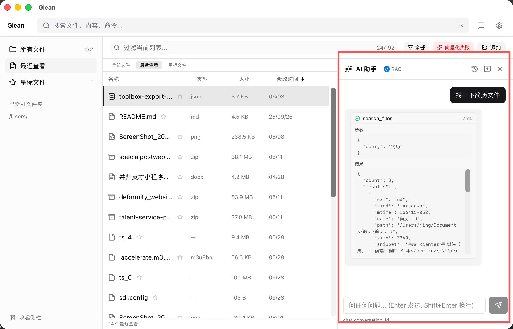
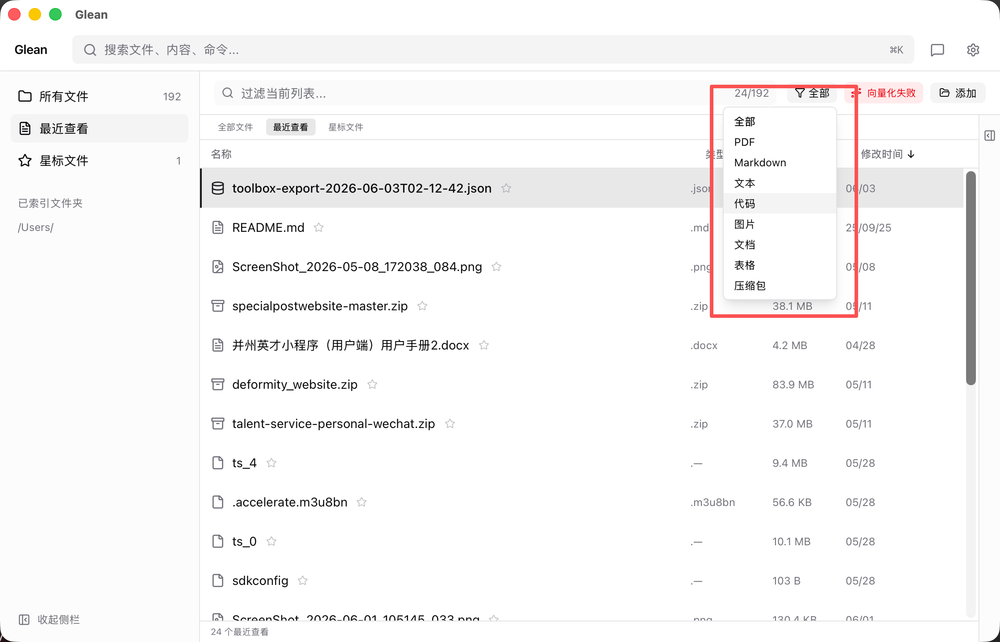
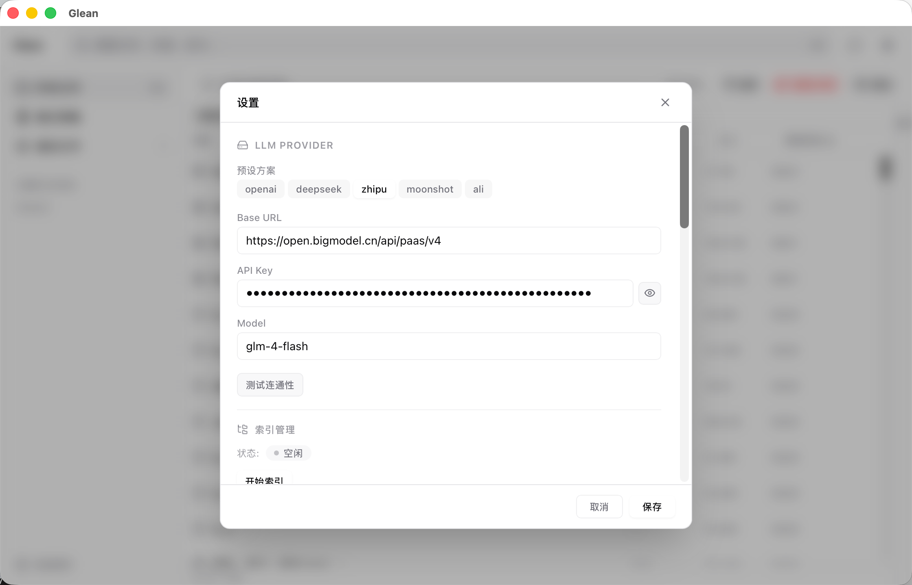

<p align="center">
  
</p>

<h1 align="center">Glean</h1>

<p align="center">
  <a href="./README.md">中文</a> · <a href="./README_EN.md">English</a>
</p>

<p align="center">
  A local-first, AI-native macOS file manager
</p>

<p align="center">
  Pick value from the files scattered across your computer — find them, remember them, organize automatically.
</p>

<p align="center">
  <a href="https://github.com/WalkAlone0325/glean/actions/workflows/ci.yml"></a>
  <a href="https://github.com/WalkAlone0325/glean/releases"></a>
  <a href="https://walkalone0325.github.io/glean/"></a>
  
  <a href="./LICENSE"></a>
  
  
  
</p>

---

## ✨ What is Glean

Glean solves the **"I have 5000 files on my Mac, I know I've seen it, but I can't find it"** problem.

**Core capabilities**:

- 🗂 **Smart Indexing** — Scans `~/Documents`, `~/Downloads`, `~/Desktop`. Understands PDF / Markdown / Images / Mails
- 🔍 **Semantic Search** — Natural language queries: "Where's that funding PDF from last week?"
- 🤖 **Agent Execution** — Find files + organize + rename + auto-tag
- 🔒 **Local-first** — All data stored locally. BYOK for LLM. Zero server dependencies

---

## 📸 Preview

<p align="center">
  
</p>

<p align="center">
  
</p>

<details>
<summary>📸 More screenshots</summary>

| Search Palette | AI Assistant + Tool Calling |
|:---:|:---:|
|  |  |

| Tag Management | Settings |
|:---:|:---:|
|  |  |

</details>

---

## 🛠 Tech Stack

| Layer | Tech |
|-------|------|
| Shell | Tauri v2 |
| Frontend | Vue 3.5 + TypeScript + Vite 6 |
| UI | Tailwind CSS v4 + Lucide Icons |
| State | Pinia 3 + VueUse |
| Backend | Rust |
| Database | SQLite (rusqlite + rusqlite_migration) + FTS5 |
| Watcher | notify |
| i18n | vue-i18n v9 (zh-CN / en) |

---

## 📥 Download & Install

### macOS

> ⚠️ **Apple Silicon only (M1/M2/M3/M4) for now.** Intel Mac support is planned (blocked by `ort-sys` x86_64 prebuilt availability).
2. Open the `.dmg` and drag Glean to Applications
3. On first launch, if you see "Cannot verify developer", run:
   ```bash
   xattr -dr com.apple.quarantine /Applications/Glean.app
   ```

### Build from source

```bash
git clone https://github.com/WalkAlone0325/glean.git
cd glean
pnpm install
pnpm tauri build
```

---

## ⌨️ Keyboard Shortcuts

| Shortcut | Action |
|----------|--------|
| `⌘ + Shift + Space` | Show / hide main window |
| `⌘ + K` | Open search palette |
| `⌘ + B` | Toggle AI assistant |
| `Enter` | Open file / Send message |
| `Esc` | Close panel / dialog |

---

## 🔐 Privacy

- All file index, chat history, and config are stored locally in SQLite. Nothing is uploaded.
- API Key is only used to call your configured LLM provider.
- No telemetry, crash reports, or usage statistics collected.

---

## 🗺 Roadmap

| Phase | Status |
|-------|--------|
| Phase 0: Foundation | ✅ |
| Phase 1: File Indexing | ✅ |
| Phase 2: Semantic Search | ✅ |
| Phase 3: Agent Tools | ✅ |
| Phase 4: Polish & Distribution | 🚧 |

---

## 📄 License

[MIT](./LICENSE) © 2026 Glean Authors
